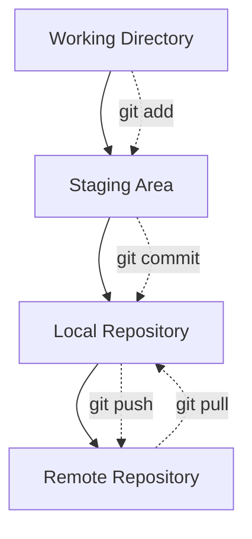

# GitHub Commands

## What is Git and Why Do We Need It?

**Git** is a distributed version control system that helps developers track changes in source code during software development. It allows multiple people to work on a project at the same time, keeps a history of every change, and makes it easy to collaborate and revert to previous versions if needed.

**Key Benefits:**
- Collaboration: Multiple developers can work together.
- History: Track every change and revert if necessary.
- Branching: Experiment with new features safely.
- Distributed: Every user has a full copy of the repository.

---

## Common Git Commands

| Command                | Description & Usage                                                                 |
|------------------------|-------------------------------------------------------------------------------------|
| `git init`             | Initializes a new Git repository in the current directory.                         |
| `git clone <url>`      | Copies a remote repository to your local machine.                                  |
| `git status`           | Shows the status of changes as untracked, modified, or staged.                     |
| `git add <file>`       | Stages changes for the next commit.                                                |
| `git add .`            | Stages all changes in the current directory.                                       |
| `git commit -m "msg"`  | Records staged changes to the repository with a message.                           |
| `git log`              | Shows the commit history.                                                          |
| `git diff`             | Shows differences between files or commits.                                        |
| `git branch`           | Lists, creates, or deletes branches.                                               |
| `git checkout <branch>`| Switches to another branch.                                                        |
| `git merge <branch>`   | Merges changes from another branch into the current branch.                        |
| `git pull`             | Fetches and merges changes from the remote repository.                             |
| `git push`             | Uploads local commits to the remote repository.                                    |
| `git remote -v`        | Shows remote repository URLs.                                                      |
| `git rm <file>`        | Removes a file from the working directory and stages the removal.                  |
| `git stash`            | Temporarily saves changes that are not ready to commit.                            |
| `git reset`            | Unstages changes or resets to a previous commit.                                   |
| `git fetch`            | Downloads objects and refs from another repository.                                |
| `git rebase <branch>`  | Applies changes from one branch onto another.                                      |

---

## How Git Works (Diagram)

**Explanation:**
- **Working Directory:** Where you edit files.
- **Staging Area:** Where you prepare files for commit (`git add`).
- **Local Repository:** Where commits are stored locally (`git commit`).
- **Remote Repository:** Central server (e.g., GitHub) for collaboration (`git push`/`git pull`).

---

## Summary

Git helps teams manage code changes efficiently, supports branching and merging, and provides a robust history of all modifications. It is essential for modern software development and collaboration.